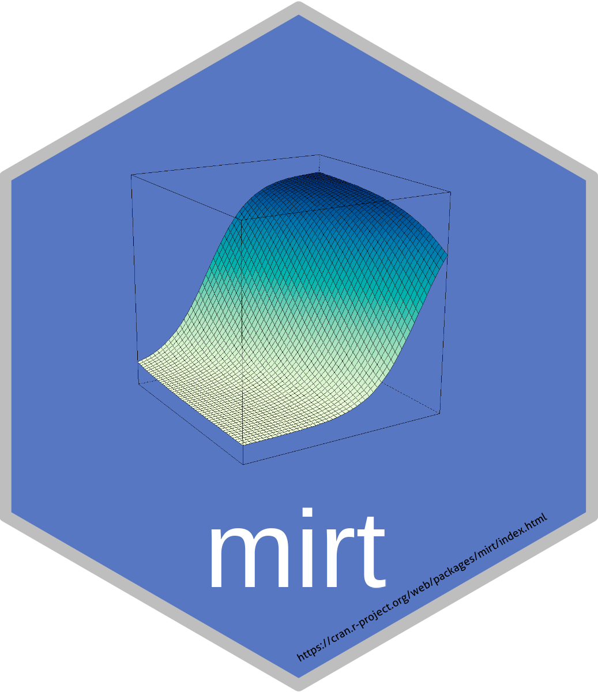

[](https://www.r-pkg.org:443/pkg/mirt) [](https://CRAN.R-project.org/package=mirt)

# *mirt*: Multidimensional item response theory in R 

Analysis of discrete response data using unidimensional and multidimensional item analysis models under the Item Response Theory paradigm (Chalmers, 2012). Exploratory and confirmatory item factor analysis models are estimated with quadrature (EM) or stochastic (MHRM) methods. Confirmatory bi-factor and two-tier models are available for modeling item testlets using dimension reduction EM algorithms, while multiple group analyses and mixed effects designs are included for detecting differential item, bundle, and test functioning, and for modeling item and person covariates. Finally, latent class models such as the DINA, DINO, multidimensional latent class, mixture IRT models, and zero-inflated response models are supported, as well as a wide family of probabilistic unfolding models.

## Examples and evaluated help files are available on the wiki

Various examples and worked help files have been compiled using the `knitr` package to generate
HTML output, and are available on the package [wiki](https://github.com/philchalmers/mirt/wiki). 
User contributions are welcome!

## Installing from source

It's recommended to use the development version of this package since it is more likely to be up to date
than the version on CRAN. To install this package from source:

1) Obtain recent gcc, g++, and gfortran compilers. Windows users can install the
   [Rtools](https://CRAN.R-project.org/bin/windows/Rtools/) suite while Mac users will have to
   download the necessary tools from the `Xcode` suite and its
   related command line tools (found within Xcode's Preference Pane under Downloads/Components); most Linux
   distributions should already have up to date compilers (or if not they can be updated easily). 
   Windows users should include the checkbox option of installing Rtools to their path for 
   easier command line usage.

2) Install the `devtools` package (if necessary). In R, paste the following into the console:

```r
install.packages('devtools')
```

3) Load the `devtools` package (requires version 1.4+) and install from the Github source code.

```r
library('devtools')
install_github('philchalmers/mirt')
```

### Installing from source via git

If the `devtools` approach does not work on your system, then you can download and install the
repository directly. 

1) Obtain recent gcc, g++, and gfortran compilers (see above instructions).

2) Install the git command line tools (e.g., from `https://git-scm.com/downloads/`).

3) Open a terminal/command-line tool. The following code will download the repository 
code to your computer, and install the package directly using R tools 
(Windows users may also have to add R and git to their path)

```
git clone https://github.com/philchalmers/mirt
R CMD INSTALL mirt
```

### Special Mac OS X Installation Instructions

In some reported cases `XCode` does not install the appropriate `gfortran` compilers in the correct location, therefore they have to be installed manually instead. This is accomplished by inputing the following instructions into the terminal:

```
curl -O http://r.research.att.com/libs/gfortran-4.8.2-darwin13.tar.bz2
sudo tar fvxz gfortran-4.8.2-darwin13.tar.bz2 -C /
```

# Licence

This package is free and open source software, licensed under [GPL (>= 3)](http://www.gnu.org/licenses/gpl-3.0.en.html).

# Bugs and Questions

Bug reports are always welcome and the preferred way to address these bugs is through
the Github 'issues'. Feel free to submit issues or feature requests on the site, and I'll
address them ASAP. Also, if you have any questions about the package, or IRT in general, then
feel free to create a 'New Topic' in the
[mirt-package](https://groups.google.com/forum/#!forum/mirt-package) Google group. Cheers!
